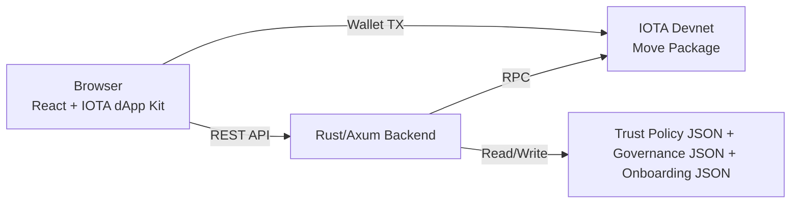

# Passapawn 🎓🐾
> Tamper-proof credentials for the real world, powered by IOTA.

## The Problem
Schools and clinics still rely on paper documents and centralized databases for credentials, certificates, and records. These systems are slow to verify, easy to dispute, and hard to share across institutions.

Centralized credential stores also create data silos and privacy risk. GDPR-aligned handling becomes harder when sensitive personal or medical data is duplicated across multiple databases.

## The Solution
Passapawn enables institutions to issue tamper-proof credential references on IOTA while keeping raw personal data off-chain. Credentials are notarized with hash-first payloads and verified through domain-scoped trust policy.

Flow: institution issues on IOTA → holder sees credential in wallet → anyone verifies through a shareable link. No central authority controls issuance; trust is policy-gated by domains, issuers, and templates.

## Architecture

## Quick Start
Prerequisites:
- Node.js 20+
- Rust stable
- IOTA wallet browser extension

1. Install dependencies:
   - Frontend: `npm install`
   - Backend: `cd src/notarization-service && cargo build`
2. Copy env templates:
   - `cp .env.example .env`
   - `cp src/notarization-service/.env.example src/notarization-service/.env`
3. Start backend:
   - `cd src/notarization-service && cargo run`
4. Start frontend:
   - `npm run dev`
5. Open `http://localhost:5173`, connect wallet, and follow the demo flow.

Docker (backend only, frontend still runs with Vite):
- `docker-compose up --build`

## Demo Seed Utility
Generate deterministic demo IDs and env suggestions:
- `npm run seed:demo`

This utility is hackathon-oriented and includes a TODO adapter for real transaction signing.

## Demo Flow (Judge Walkthrough)
1. Open the app URL and read the landing page.
2. Connect IOTA wallet.
3. Create domain: `PassaPawn Demo School`.
4. Submit + publish template: `B2 Language Certificate`.
5. Issue a credential via locked or dynamic notarization.
6. Verify in the Verify tab and inspect the trust verdict.
7. Click **Copy verify link 🔗**, open in incognito, and see verdict with no wallet.

> 🚀 **KILLER DEMO MOMENT:** verification works from a plain browser link in incognito without wallet setup.

## Move Package
- Package address: `0xbc6b8d122ab9b277e9ba4d1173bc62fdbdd07f2f4935f6f55327f983833b9afb`
- Network: IOTA devnet
- Modules: `credential_domain`, `templates`, `asset_record`, `field_schema`

## Public APIs Added in Phase 4
- `GET /api/v1/public/verify/:id` (no auth)
- `GET /api/v1/holder/:address/credentials` (no auth)

## Known Limitations
- `scripts/seed_demo.ts` uses a TODO adapter for real signed governance transactions.
- Holder credential extraction depends on current devnet `iota_getOwnedObjects` response shape.
- Share links verify by object ID (and optional payload), not selective disclosure.

## v5 Backlog
- Selective disclosure with ZK proofs for verifier-minimized data sharing.
- Multi-chain verification adapters with policy parity.
- Mobile wallet-first holder UX and push notifications.
