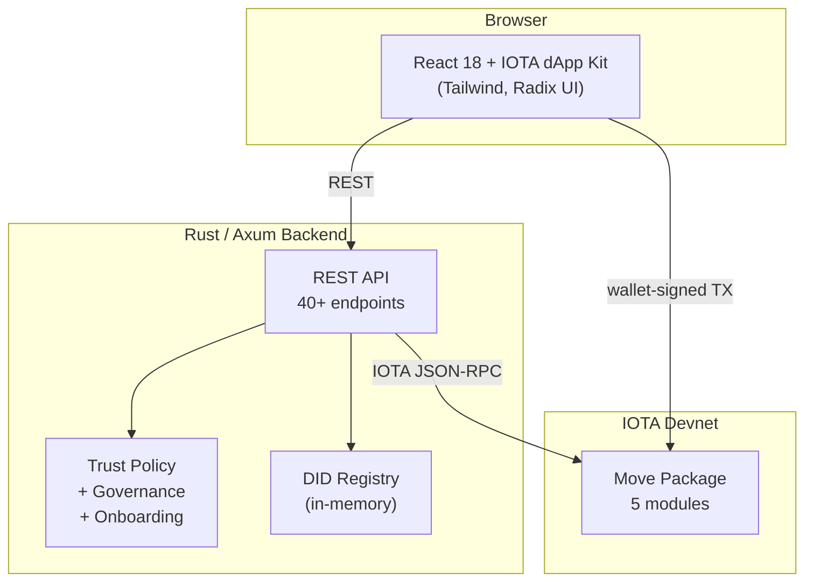

# Passapawn 🎓🐾

> **Tamper-proof credentials for the real world, powered by IOTA.**


---

## What is Passapawn?

Passapawn is an end-to-end credential issuance, holding and verification platform deployed on the IOTA devnet. It lets institutions (universities, clinics, certification bodies) issue tamper-proof credential references on-chain while keeping raw personal data off-chain — ready for GDPR-aligned, privacy-preserving use.

The platform combines **IOTA Notarization** for cryptographic anchoring, a **Decentralized Identifier (DID)** registry for issuer identity, and an optional **Account Abstraction (AA)** layer for multi-sig institutional governance — all orchestrated by a Rust backend and a React single-page application.

Credential holders see their portfolio in a wallet-connected view and can generate Ed25519-signed presentation tokens. Verifiers only need a shareable link — no wallet, no login, no app install.

---

## The Problem

Schools, clinics and certification bodies still rely on paper documents, PDF exports and centralized databases for credentials. These systems are:

- **Slow to verify** — employers and admissions offices phone or email the issuing institution and wait days for a reply.
- **Easy to forge** — a PDF or paper certificate carries no cryptographic proof of origin.
- **Hard to share** — each institution stores credentials in its own silo; holders have no unified portfolio.
- **Privacy-hostile** — centralised credential stores duplicate sensitive data and make GDPR compliance an operational burden.

## The Solution

Passapawn replaces paper trails with on-chain credential references anchored by IOTA Notarization:

1. **Issue** — An institution creates a credential domain, publishes a typed template, and issues credentials on IOTA. Sensitive fields are hashed before touching the chain; only the hash goes on-chain.
2. **Hold** — The credential holder sees every issued credential in a wallet-connected portfolio, can filter by type, date and validity, and can generate a signed presentation token to prove ownership.
3. **Verify** — Anyone with a verify link checks the credential against on-chain state plus off-chain trust policy. No wallet needed — works in a plain incognito browser tab.

No single authority controls issuance. Trust is governed by configurable domain-scoped policy, multi-sig governance proposals, and optional DID-linked issuer identity.

---

## Architecture



### Move Smart Contracts

| Module | Purpose | Key entry functions |
|--------|---------|---------------------|
| `credential_domain` | Multi-sig governed credential domains with proposal-based template governance | `create_domain`, `submit_proposal`, `approve_proposal`, `execute_proposal`, `decree_template` |
| `templates` | Entry-point wrappers that accept flat vectors (no struct args) for Move entry calls | `create_domain`, `submit_proposal`, `approve_proposal`, `execute_proposal`, `decree_template` |
| `asset_record` | On-chain credential records linked to a notarization + domain | `create_credential_record`, `revoke_credential_record` |
| `field_schema` | Typed field descriptors with constraints (min/max length, min/max value, pattern hints) | `new`, `new_field_with_constraints`, `validate_field_type` |
| `passapawn_aa` | Account Abstraction — multi-sig Ed25519 accounts for institutional governance | `create`, `authenticate` |

### Backend (Rust / Axum)

The backend provides 40+ REST endpoints covering:

- **Notarization** — locked (immutable) and dynamic (updatable / transferable) credential issuance via IOTA Notarization.
- **Verification** — multi-layer verdicts checking on-chain state, trust policy, revocation, disputes, expiry, domain trust and template validity.
- **Credential Explorer** — paginated, filterable listing of on-chain `AssetRecord` objects.
- **Holder Portfolio** — wallet-address-based credential listing with inline verification.
- **Presentation Verification** — Ed25519-signed presentation tokens proving credential ownership.
- **DID Registry** — in-memory DID document creation and resolution tied to credential domains.
- **Trust Policy & Governance** — versioned policy drafts with signature-based activation, rollback and freeze.
- **Issuer Onboarding** — multi-step onboarding workflow (request → review → activate) that auto-adds issuers to trust policy.
- **Account Abstraction** — transaction intent builders for multi-sig AA accounts and governance proposals.
- **Operational** — per-IP rate limiting, idempotency, admin nonces, SLO metrics, synthetic monitoring, compliance reporting, progressive launch modes (`dry_run` → `canary` → `full`).

### Frontend (React 18 + TypeScript)

| Component | Role |
|-----------|------|
| `LandingHero` | Product intro when disconnected; quick-nav cards when connected |
| `GettingStarted` | 5-step onboarding wizard |
| `DomainPanel` | Create domains, define field schemas with constraints, multi-sig governance, DID creation, AA integration |
| `IssuerPanel` | Credential issuance form — locked / dynamic, single / batch, public / private fields, tags, expiry |
| `IssuerDashboard` | View issued credentials per domain with verification status and on-chain revocation |
| `HolderView` | Credential portfolio with grid/list views, filtering, presentation generation, QR sharing |
| `VerifierPanel` | Verify by ID, display rich verdicts, shareable links and QR codes |
| `VerifierHistory` | Timeline of past verifications with filtering and JSON export |
| `CredentialExplorer` | Public credential catalog with tag filtering, pagination, status badges, QR sharing |
| `PresentationViewer` | Verify signed presentation tokens |
| `AaGovernancePanel` | Create AA accounts and transfer DomainAdminCap to AA |
| `AaProposalSigner` | Collect multi-sig Ed25519 signatures for AA governance transactions |
| `PolicyAdminPanel` | Manage trusted issuers, domains and blocked credentials |
| `OnboardingAdminPanel` | Issuer onboarding lifecycle management |

---

## IOTA Frameworks Used

### 1 — IOTA Notarization

Every credential is anchored via the IOTA Notarization crate (`notarization` v0.1). The backend builds a notarization intent (locked or dynamic), the frontend wallet signs it, and the resulting on-chain object is linked to an `AssetRecord` in our Move package. Verification reads the notarization state, checks its hash against the payload, and layers on trust-policy rules.

### 2 — IOTA Identity (DID)

Credential domains can mint a DID document that binds the domain's on-chain object ID to a resolvable `did:iota:devnet:…` identifier. The DID includes a verification method derived from the issuer's wallet address and is stored in an in-memory registry exposed via REST (`/api/v1/did/create`, `/api/v1/did/resolve/:id`, `/api/v1/did/list`).

### 3 — IOTA Account Abstraction

The `passapawn_aa` Move module implements a k-of-n Ed25519 multi-sig account using `iota::account::create_account_v1` and `iota::authenticator_function`. Institutions can wrap their `DomainAdminCap` inside an AA account so that governance proposals (template changes, revocations) require threshold signatures from multiple trustees. The frontend provides a dedicated AA panel and a multi-signer workflow.

---

## Quick Start

### Prerequisites

| Tool | Version |
|------|---------|
| Node.js | 20+ |
| Rust | stable (1.75+) |
| IOTA wallet extension | latest (e.g. IOTA Wallet for Chrome) |

### 1. Clone and install

```bash
git clone <repo-url> && cd passapawn

# Frontend
npm install

# Backend
cd src/notarization-service && cargo build --release
```

### 2. Configure environment

```bash
# Frontend (Vite)
cp .env.example .env
# → set VITE_NOTARIZATION_API_URL (default http://127.0.0.1:8080)

# Backend
cp src/notarization-service/.env.example src/notarization-service/.env
# → set IOTA_NODE_URL, IOTA_PACKAGE_ID, NOTARIZATION_ADMIN_API_KEY
```

### 3. Start

```bash
# Terminal 1 — backend
cd src/notarization-service && cargo run --release

# Terminal 2 — frontend
npm run dev
```

### 4. Open

Navigate to `http://localhost:5173`, connect your IOTA wallet, and follow the guided demo flow.

### Docker (backend only)

```bash
docker-compose up --build
# Backend on port 3001, frontend still via `npm run dev`
```

---

## Demo Walkthrough (for Judges)

> Follow these 10 steps to see the full credential lifecycle in under 5 minutes.

| # | Action |
|---|--------|
| 1 | Open the app and read the **landing page** — it explains the problem and the three IOTA frameworks used. |
| 2 | Click **Connect Wallet** and approve in the IOTA wallet extension. |
| 3 | In the **Domain** tab, create a domain (e.g. `PassaPawn Demo School`). Note the on-chain domain ID. |
| 4 | In the same tab, define a template (e.g. `B2 Language Certificate`) with typed fields and constraints, then submit and publish it through the governance proposal flow. |
| 5 | Switch to the **Issue** tab. Select the domain + template, fill in credential fields, choose **Locked** or **Dynamic** notarization, and sign the transaction. |
| 6 | Try **Batch mode**: toggle to Batch, set the count to 3, and issue three credentials in one click. Watch the progress bar track each transaction. |
| 7 | Open the **Holder** tab to see the credential in your portfolio. Click **Present** to generate a signed presentation token, or click the **QR** button to get a shareable QR code. |
| 8 | Go to the **Verify** tab, paste the credential object ID, and inspect the multi-layer trust verdict and metadata card. |
| 9 | Click **Copy verify link**, open it in a **private / incognito window** — the credential verifies with no wallet and no login. |
| 10 | Explore the **Explorer** tab for the public credential catalog, the **Admin** tabs for trust policy and onboarding, and the **AA** section for multi-sig account creation. |

> 🚀 **KILLER DEMO MOMENT:** Step 9 — verification works from a plain browser link in incognito. No wallet, no app, no signup. Just a URL.

---

## API Overview

| Method | Path | Auth | Purpose |
|--------|------|------|---------|
| `GET` | `/health` | — | Health check |
| `POST` | `/api/v1/notarizations/locked` | — | Create locked notarization intent |
| `POST` | `/api/v1/notarizations/dynamic` | — | Create dynamic notarization intent |
| `POST` | `/api/v2/credential-record/intent` | — | Build `create_credential_record` TX intent |
| `GET` | `/api/v1/public/verify/:id` | — | Public credential verification |
| `POST` | `/api/v1/notarizations/:id/verify` | — | Verify with payload body |
| `GET` | `/api/v1/public/present` | rate-limited | Verify signed presentation token |
| `GET` | `/api/v1/holder/:address/credentials` | rate-limited | List credentials by wallet address |
| `GET` | `/api/v1/explorer/credentials` | — | Paginated credential explorer |
| `GET` | `/api/v1/templates/:template_id/fields` | — | Template field descriptors |
| `POST` | `/api/v1/did/create` | — | Create DID document |
| `GET` | `/api/v1/did/resolve/:did_id` | — | Resolve DID document |
| `POST` | `/api/v2/aa/create-account-intent` | — | AA account creation intent |
| `POST` | `/api/v2/aa/governance-intent` | — | AA governance TX intent |
| `POST` | `/api/v2/aa/submit` | — | Submit signed AA transaction |
| `GET` | `/api/v2/policy/active` | `policy-admin` | Active trust policy |
| `POST` | `/api/v2/policy/draft` | `policy-admin` | Create policy draft |
| `POST` | `/api/v2/policy/activate` | `policy-admin` | Activate policy draft |
| `POST` | `/api/v2/onboarding/request` | `onboarding-admin` | Submit onboarding request |
| `POST` | `/api/v2/onboarding/review` | `onboarding-admin` | Review onboarding |
| `POST` | `/api/v2/onboarding/activate` | `onboarding-admin` | Activate onboarding |
| `POST` | `/api/v2/credentials/:id/revoke-onchain` | `policy-admin` | On-chain revocation intent |
| `GET` | `/api/v2/metrics` | — | SLO / SLA metrics |
| `GET` | `/api/v2/compliance/report` | `policy-admin` | Compliance audit report |
| `POST` | `/api/v2/launch/mode` | `policy-admin` | Set launch mode |
| `POST` | `/api/v2/launch/rollback` | `policy-admin` | Emergency rollback |

> Role-based endpoints require `x-role` + `x-api-key` headers. Mutations additionally require `x-admin-nonce` + `x-idempotency-key`.

---

## Move Package

| Field | Value |
|-------|-------|
| **Package ID** | `0x488888e8dde8048f6406d1563f63903e9d41f54599e8e0c5376d1bca92083830` |
| **Metadata ID** | `0xb5b4a7d056b55692846ee73ab4651a8025769ed31dffc4fb63d93986b7ef24a6` |
| **Network** | IOTA devnet |
| **Modules** | `credential_domain`, `templates`, `asset_record`, `field_schema`, `passapawn_aa` |

---

## Project Structure

```
passapawn/
├── index.html                      # Vite entry point
├── package.json                    # Frontend dependencies & scripts
├── vite.config.ts                  # Vite + Tailwind config
├── tsconfig.json                   # TypeScript config
├── docker-compose.yml              # Docker setup (backend)
│
├── move/counter/                   # Move smart contracts
│   ├── Move.toml
│   └── sources/
│       ├── asset_record.move       # On-chain credential records
│       ├── credential_domain.move  # Multi-sig governed domains
│       ├── field_schema.move       # Typed field descriptors + constraints
│       ├── templates.move          # Entry-point wrappers
│       └── passapawn_aa.move       # Account Abstraction module
│
├── src/
│   ├── App.tsx                     # Root app with tab routing
│   ├── main.tsx                    # React entry point
│   ├── constants.ts                # Package IDs, types
│   ├── flowState.ts                # Zustand flow state
│   ├── networkConfig.ts            # IOTA network config
│   ├── notarizationApi.ts          # Backend API client
│   │
│   ├── components/                 # 20+ React components
│   │   ├── LandingHero.tsx         # Landing page
│   │   ├── DomainPanel.tsx         # Domain management + governance
│   │   ├── IssuerPanel.tsx         # Credential issuance (single + batch)
│   │   ├── HolderView.tsx          # Credential portfolio
│   │   ├── VerifierPanel.tsx       # Verification + shareable links
│   │   ├── CredentialExplorer.tsx  # Public credential catalog
│   │   └── ...                     # See Frontend table above
│   │
│   └── notarization-service/       # Rust backend
│       ├── Cargo.toml
│       ├── Dockerfile
│       └── src/
│           ├── main.rs             # Axum server + all route handlers
│           ├── client.rs           # IOTA RPC client
│           ├── model.rs            # Domain types
│           ├── dto.rs              # Request / response DTOs
│           ├── config.rs           # Env-based configuration
│           ├── error.rs            # Error types
│           ├── secrets.rs          # Secrets provider
│           ├── trust_registry.rs   # Trust policy engine
│           ├── policy_governance.rs# Policy governance state machine
│           ├── onboarding_registry.rs # Onboarding workflow
│           ├── locked.rs / locked_impl.rs   # Locked notarization
│           ├── dynamic.rs / dynamic_impl.rs # Dynamic notarization
│           └── verify_impl.rs      # Multi-layer verification
│
└── scripts/
    └── seed_demo.ts                # Demo data seeder
```

---

## Known Limitations

1. **AA wallet support** — The Account Abstraction Move module is deployed on-chain, but current browser wallets (IOTA Wallet) do not yet support AA-authenticated transactions. The AA panel is marked "Architecture Ready."
2. **In-memory DID registry** — DID documents are stored in-memory and are lost on backend restart. A persistent store is planned.
3. **Batch issuance sends to issuer wallet** — Batch-issued credentials are all assigned to the connected (issuer) wallet address. Per-holder batch distribution requires a future CSV-import flow.
4. **Devnet only** — The Move package is published on IOTA devnet. Testnet and mainnet package IDs are not yet configured.
5. **No selective disclosure** — Verification is all-or-nothing against the on-chain record. ZK-based selective disclosure is on the roadmap.

---

## Roadmap

- [ ] Selective disclosure with ZK proofs for verifier-minimized data sharing
- [ ] Persistent DID registry backed by on-chain or IPFS storage
- [ ] Per-holder batch issuance via CSV import
- [ ] AA wallet integration when browser wallets support AA transactions
- [ ] Multi-chain verification adapters with policy parity
- [ ] Mobile wallet-first holder UX and push notifications
- [ ] Testnet / mainnet deployment

---

## License

MIT
